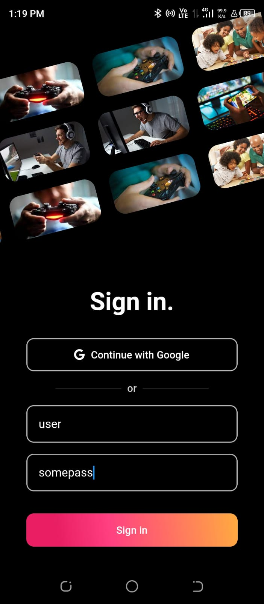
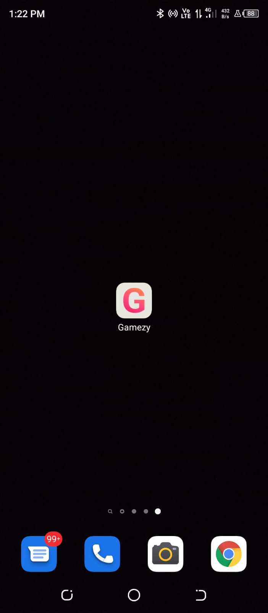

# Gamezy (Buzz Talk)

Gamezy is a project developed for the technical round for **Buzz Talk**. The layout is developed with flutter/ dart and it can be viewed in light and dark mode by changing mobile settings.

<p float="left">
  
  &nbsp; &nbsp; &nbsp; &nbsp;
  
  &nbsp; &nbsp; &nbsp; &nbsp;
  
</p>

<p float="left">
  
  &nbsp; &nbsp; &nbsp; &nbsp;
  
  &nbsp; &nbsp; &nbsp; &nbsp;
  
</p>

<p float="left">
  
  &nbsp; &nbsp; &nbsp; &nbsp;
  
</p>

## 🏃 Running The Project

**Step 1:**

Download or clone this repo by using the link below:

```
https://github.com/YashMakan/spean_flutter_interview.git
```

**Step 2:**

Go to the project root and execute the following command in the console to get the required dependencies. **Make sure flutter is installed and set in the PATH**

```
flutter pub get
```

**Step 3:**

After installing the dependencies run the project using the below command

```
flutter run
```

## 🚧 APK Installation

The APK for the app can be installed by [this](https://drive.google.com/file/d/15xDl5EApcwrb6l72GIad_nJcDqjV91Bj/view?usp=sharing) link. One can also build APK by running the following command

```
flutter build apk
```

## 🧑 About me:
I am Yash Makan, a full-stack app developer & web developer with 4 years of experience. I am also a tech blogger, online tutor, backend APIs developer in RapidAPI, loves automating stuff, machine learning enthusiast with an interest in the combination of technology and finance.

Creating stuff and technology is like my love at first sight. I am very passionate about creating software, applications, websites, APIs, automation scripts that can help me in my daily life and can even help people around me. Recently, I have started showing some interest in artificial intelligence technology in python and I am loving it.

## 🦸‍♂️ Why I am a great fit for the role?
* I have 4 years of experience in developing full-stack cross-platform apps.
* I have complete knowledge of using firebase with real-time database, cloud firestore, authentication(Google, Facebook, Twitter, email, phone number), storage.
* I know modern technologies like python, Django, flask, flutter, dart, automation, machine learning, image processing and currently pursuing blockchain & web3.
* I have experience in developing UI/UX designs and know software like Figma & photoshop. I can develop any type of complex and beautiful designs in Figma as well as flutter.
* I can maintain the performance of the app by using state management and have developed an app that has over 50k users. Thereby, can create professional fast apps that can handle multiple users.
* I am very honest, reliable, punctual with deadlines and also socially friendly.

## 📫 Contact Me:

<a href="mailto:yashmakan.work@gmail.com"></a> &nbsp;
<a href="https://twitter.com/Yash_Makan"></a> &nbsp;
<a href="https://yashmakan.hashnode.dev/"></a> &nbsp;
<a href="https://www.linkedin.com/in/yashmakan/"></a> &nbsp;
<a href="https://instagram.com/yashmakan"></a> &nbsp;
